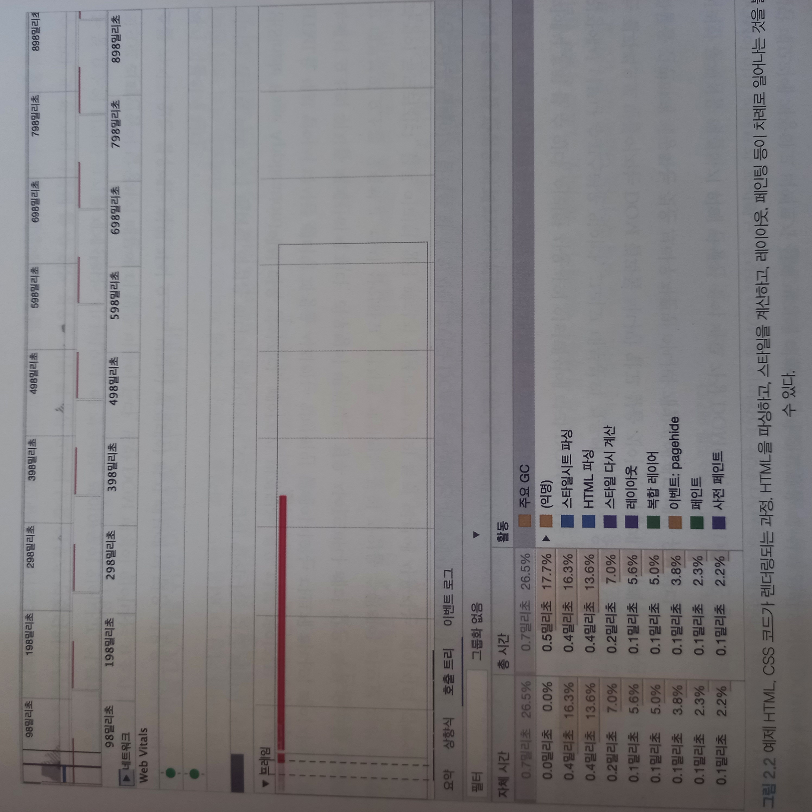

## 가상 DOM과 리액트 파이버

## DOM과 브라우저 렌더링 과정


5번에서 보이는 것처럼 Layout이 일어나면 Painting은 무조건 일어난다.

크롬 개발자 도구에서 보면 다음과 같다.



HTML 파싱, Style 계산, 레이아웃, 페인팅이 차례로 일어난다.

## 가상 DOM의 탄생 배경

한 페이지에서 JS를 통해서 모든 작업을 처리하는 SPA에서는 인터렉션마다 위와 같은 렌더링 과정을 통째로 해야할 수도 있다.

부모 요소의 layout을 건들면 painting까지 무조건 이루어지는데 이는 자식요소도 마찬가지로 일어나기 때문에 굉장히 비효율적이다.

모든 DOM의 변경보다 결과적으로 만들어지는 DOM 결과물 하나만 알고 싶은 것이 개발자나 브라우저가 바라는 것이다. 이를 해결하기 

위해 탄생한 것이 가상 DOM이다.

## 가상 DOM

실제 브라우저의 DOM이 아닌 리액트가 관리하는 가상의 DOM이다.

가상 DOM은 이용해 페이지에 표시해야 할 DOM을 일단 메모리에 저장하고 react-dom이 실제 변경에 대한 준비가 되었을 때 실제 브라우저의 DOM에 반영한다.

DOM 계산을 브라우저가 아닌 메모리에서 계산하는 과정을 한번 거치게 되면 실제로는 여러 번 발생했을 렌더링 과정을 최소화할 수 있고 브라우저와 개발자의 부담을 덜 수 있다.

가상 DOM은 일반적인 DOM보다 무조건 빠르지는 않다. 앱을 개발할 수 있을 만큼 합리적으로 빠르기 때문에 채용한 것이다.

## 가상 DOM을 위한 아키텍처, React Fiber

여러 번의 렌더링 과정을 압축해 최소한의 렌터링 단위를 만들어 내기 위해 필요한 아키텍처

## React fiber

React에서 관리하는 평범한 JS 객체이다.

fiber는 fiber reconciler(파이버 재조정자)가 관리하는데, 

가상 DOM과 실제 DOM을 비교해서 변경 사항을 수집, 차이가 있으면 해당 정보를 가지고 있는 파이버를 기준으로 렌더링을 요청한다.

## react fiber의 목표

`reconciliation` : 리액트에서 어떤 부분을 새롭게 렌더링해야 하는지 가상 DOM과 실제 DOM을 비교하는 작업(알고리즘)

React web application에서 발생하는 애니메이션, 레이아웃, 그리고 사용자 인터랙션에 올바른 결과물을 만드는 반응성 문제를 해결하는 것이 react fiber의 목표이다.

하는 일은 다음과 같다.

1. 작업을 작은 단위로 분할, 우선순위를 매긴다.
2. 일시중지하고 나중에 다시 시작할 수 있다.
3. 이전에 했던 작업 재사용, 필요하지 않은 경우 폐기

위의 작용들은 비동기로 일어난다.

이전에는 스택 알고리즘, 즉 동기적으로 작업이 이루어졌었는데 모던 웹 애플리케이션의 인터랙션이 복잡해짐에따라 바뀌었다.

## react fiber의 실제 구현

fiber는 하나의 작업 단위로 구성되어 있으며 react는 이를 하나씩 처리하고 `finishedWork()`로 작업을 마무리한다.

작업이 마무리되면 이 작업을 커밋해서 실제 브라우저 DOM에 변경 사항을 만들어 낸다.

이는 다음과 같은 과정으로 나눌 수 있다.

1. render : 사용자에게 노출되지 않는 모든 비동기 작업 수행, 파이버의 작업 (우선순위를 지정하거나 중지시키거나 버리는 작업) 등이 일어난다.
2. commit : DOM에 실제 변경 사항을 반영하기 위한 작업, commitWork()가 실행되는데, 이 과정은 앞서와 다르게 동기식으로 일어나고 중단될 수도 없다.

```js
function FiberNode(tag, pendingProps, key, mode) {
  // Instance
  this.tag = tag;
  // 1:1 매칭된 정보를 가지고 있다. 연결되는 것은 리액트의 컴포넌트, HTML의 DOM 노드 혹은 다른 것일 수 있다.
  // 0 ~ 25까지 여러가지 요소들에 번호가 적혀있으며 div같은 요소를 뜻하는 HostComponent(5)나 FunctionComponent(0), ClassComponent(1)가 포함될 수 있다.
  this.key = key;
  this.elementType = null; 
  // +) 기존과는 다르게 새롭게 추가되었습니다. React 요소의 타입입니다. 예를 들어, <MyComponent />에서 elementType은 MyComponent가 됩니다
  this.type = null;
  this.stateNode = null;
  // fiber 자체에 대한 참조 정보를 가지고 있으며, 이 참조를 바탕으로 리액트는 파이버와 관련된 상태에 접근한다.
  
  // Fiber
  this.return = null; // 부모 파이버
  this.child = null; // child는 무조건 첫번째 자식의 참조로 구성된다.
  this.sibling = null; // 형제 파이버
  this.index = 0; // 자신의 위치 숫자로 표현
// 파이버 간의 관계를 나타낸다. children대신에 child 하나만 존재한다는 특징이 있다.

  this.ref = null; 
  this.refCleanup = null; 

  this.pendingProps = pendingProps; // 아직 작업을 미처 처리하지 못한 props
  this.memoizedProps = null; // Render phase가 종료된 이후 사용되었던 pendingProps를 저장
  this.updateQueue = null; // 상태 업데이트, 콜백 함수, DOM 업데이트 등 필요한 작업을 담아두는 큐
  this.memoizedState = null; // 함수 컴포넌트의 훅 목록 저장, useState를 포함한 모든 훅 리스트가 저장
  this.dependencies = null;

  this.mode = mode; 
  
  // Effects
  this.flags = NoFlags;
  
  this.subtreeFlags = NoFlags;
  this.deletions = null;
  
  this.lanes = NoLanes;
  this.childLanes = NoLanes;
  
  this.alternate = null; // 리액트의 트리는 두개인데 반대편 트리 파이버를 가리킴
}
```

위처럼 JS 객체로 이루어져 있는 파이버는 Component가 최초로 마운트되는 시점에 생성되어 렌더링이 발생할 때마다 가급적 재사용된다.

리액트에 내부적으로 파이버를 생성하는 함수가 존재하는데 Element에서, Type과 Props에서, Fragment에서 Fiber를 하나 생성하며 이는 1:1관계이다. 한 Element에서 하나의 fiber를 생성한다.

## fiber 구조 실제 코드

```jsx
<ul>
	<li>하나</li>
	<li>둘</li>
	<li>셋</li>
</ul>

// 파이버로 표현하면
const l3 = {
	return : ul,
	index: 2,
}

const l2 = {
	sibling: l3,
	return : ul,
	index: 1,
}

const l1 = {
	sibling: l2,
	return : ul,
	index: 0,
}

const ul = {
	//...
	child: l1 // 첫번째 자식노드
}
```

## updateQueue 타입구조

```ts
type UpdateQueue = {
	first: Update | null
	last: Update | null
	hasForceUpdate: boolean
	callbackList: null | Array<Callback> // setState로 넘긴 콜백 목록
}
```

updateQueue는 fiber에서 상태 업데이트, 콜백 함수, DOM 업데이트 등 필요한 작업을 담아두는 큐이다.

## React fiber tree

리액트에는 fiber tree가 두개 존재한다.

하나는 현재 모습을 담은 fiber tree, 다른 하나는 작업 중인 상태를 나타내는 `workInProgress` 트리이다.

리액트 파이버 작업이 끝나면 커밋 단계에서 리액트는 포인터를 변경해서 `workInProgress` 트리를 현재 트리로 바꾸는 것이다. ( `Double Buffering` : 컴퓨터 그래픽 분야에서 사용하는 용어로 보이지 않는 곳에서 다음 그림을 미리 그리고 완성되면 현재 그림과 바꾸는 기법 )


## fiber의 작업 순서

1. React가 beginWork() 함수를 실행해 fiber 작업을 수행한다. 리프노드에 있는 파이버를 만날 때까지 트리 형식으로 시작된다.
2. completeWork() 함수를 실행해 fiber 작업을 완료한다.
3. 형제가 있다면 형제로 넘어간다.
4. return으로 돌아가 작업이 완료됐음을 알린다.

## 예제

```jsx
<A1>
	<B1>안녕하세요</B1>
	<B2>
		<C1>
			<D1/>
			<D2/>
		</C1>
	</B2>
</A1>
```


이후 setState 등으로 업데이트가 발생하면 기존 current 트리는 이미 있고 workInProgress 트리를 다시 빌드한다.

최초 렌더링 때는 모든 fiber를 생성해야했지만 이미 current 트리를 만들 때 생성했기 때문에 기존 파이버를 재사용하여 업데이트된 props만 내부에서 처리한다.

가급적 새로운 fiber를 생성하지 않는다는 건 fiber 객체를 재조정 작업 때마다 만들지 않고 내부 속성값만 초기화하거나 바꾸는 형태로 트리를 업데이트한다는 것이다.

과거에는 이를 동기식으로 처리했다. 트리 업데이트 과정, 재귀적으로 하나의 트리를 순회해 새로운 트리를 만드는 작업 등등 이 모든 것들이 동기식이고 중단할 수 없었다.

현재는 우선순위가 높은 업데이트가 오면 작업을 일시 중단하거나 새롭게 만들거나, 폐기할 수도 있고 작업 단위를 나누어 우선순위를 할당하는 것 또한 가능하다.

리액트는 이러한 작업을 fiber 단위로 나눠서 수행한다.

애니메이션, 사용자가 입력하는 작업 (우선순위 높음) , 목록을 렌더링하는 작업 (우선순위 낮음)

## fiber와 가상 DOM

리액트 컴포넌트에 대한 정보를 1:1로 가지고 있는 것이 fiber이며 리액트 아키텍처 내에서 비동기로 이뤄진다.

하지만 실제 브라우저 구조인 DOM에 반영하는 것은 동기적으로 일어나야 하고 (commit) 처리하는 작업이 많아 화면에 불완전하게 표시될 가능성이 높으니 

이러한 작업을 가상에서, 메모리상에서 수행해서 결과물만 브라우저 DOM에 적용하는 것이다.

React fiber는 RN 같은 브라우저가 아닌 환경에서도 사용할 수 있기 때문에 파이버와 가상 DOM은 동일한 개념이 아니다.

RN과 React의 renderer는 다르지만 내부적으로 파이버를 통해 reconciliation이 되기 때문에 동일한 재조정자를 사용할 수 있게 된다.