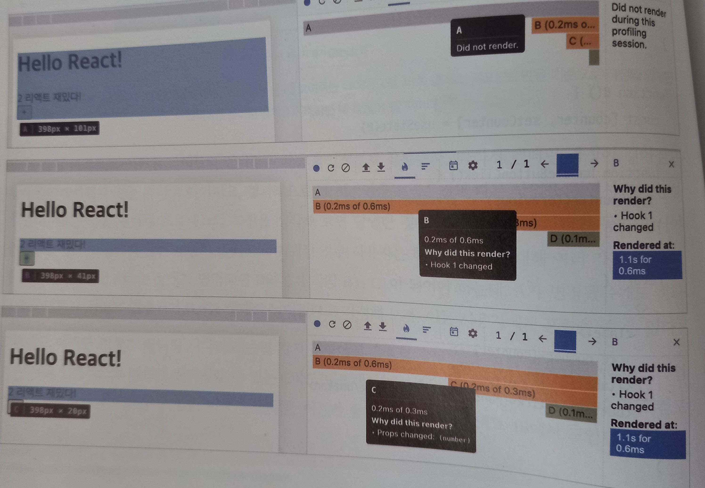
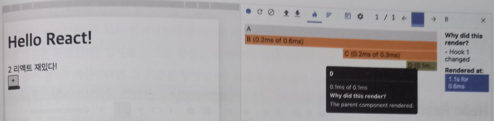
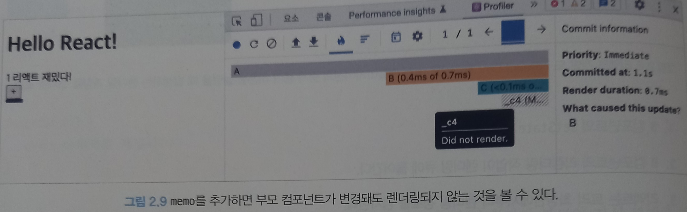

# Rendering 원리

## 개념

HTML과 CSS 리소스를 기반으로 웹페이지에 필요한 UI를 그리는 과정

React에서의 렌더링이란 브라우저가 렌더링에 필요한 DOM트리를 만드는 과정이다.

## React의 Rendering

리액트 애플리케이션 트리 안에 있는 모든 컴포넌트들이 

현재 자신들이 가지고 있는 props와 state의 값을 기반으로 

어떻게 UI를 구성하고 DOM 결과를 브라우저에 제공할 것인지 계산하는 과정

## React의 Rendering이 일어나는 이유

렌더링이 발생하는 시나리오는 다음과 같다.

## 최초 렌더링

처음 진입 시 렌더링해야할 결과물 렌더 (리액트가 브라우저에 정보를 제공하기 위해 렌더링 수행함.)

## 리렌더링 (최초 렌더링을 제외한 모든 렌더링)

### 1. 클래스 컴포넌트의 setState 실행
### 2. 클래스 컴포넌트의 forceUpdate 실행

render가 state나 props가 아닌 다른 값에 의존하고 있어서 리렌더링이 자동으로 실행되지 않으면 forceUpdate를 사용해서 리렌더링을 하는데 이때 shouldComponentUpdate를 무시하고 실행한다. 
render 내에 forceUpdate()을 사용하면 무한루프에 빠지게 된다.

### 3. 함수 컴포넌트의 useState()의 두번째 인수 setter가 실행되는 경우: state를 업데이트하는 함수이기에 실행하면 렌더링이 일어난다.

### 4. 함수 컴포넌트의 useReducer()의 두 번째 배열 요소인 dispatch가 실행되는 경우

useReducer도 useState와 마찬가지로 상태와 이 상태를 업데이트하는 함수를 배열로 제공한다. 그 함수를 사용하면 리렌더링

## 5. 컴포넌트의 key props가 변경되는 경우

모든 컴포넌트에서 사용할 수 있는 특수한 props, key는 리렌더링이 발생하는 동안 형제 요소들 사이에서 동일한 요소를 식별하는 값

파이버 트리 구조에서 형제 요소들을 식별하는 것은 sibling인데 current 트리와 workInProgress 트리를 비교해서 Double Buffering하는 과정에서 같은 요소인지 구별하는 값이 key이다
```jsx
const Child = memo(() => {
  return <li>hello</li>;
});
  
function List({ arr }: { arr: number[] }) {
  const [state, setState] = useState(0);
  
  function handleButtonClick() {
    setState((prev) => prev + 1);
  }
  
  return (
    <>
      <button onClick={handleButtonClick}>{state}+</button>
  
      <ul>
        {arr.map((_, index) => {
          <Child />;
        })}
      </ul>
    </>
  );
}
```

부모 컴포넌트인 List의 렌더링이 발생해도 Child는 memo로 선언되어 있어서 리렌더링이 발생하지 않는다. `<Child key={index}/>`와 동일하게 작동한다.

만약 다음과 같이 Child가 설정되어 있다면

```jsx
<Child key={Math.random()}/>
```

리렌더링이 일어날 때마다 sibling 컴포넌트를 구분할 수 없어서 memo로 Child가 찍혀 있더라도 리렌더링이 매번 일어나게 된다.

`key`의 변화가 리렌더링을 야기한다는 것을 알 수 있다.

### 6. props가 변경되는 경우

부모로부터 전달받는 값인 props가 달라지면 이를 사용하는 자식 컴포넌트에서도 변경이 필요하므로 리렌더링이 일어난다.

## 7. 부모 컴포넌트가 렌더링될 경우

부모 컴포넌트가 리렌더링되면 자식 컴포넌트도 무조건 리렌더링이 일어난다.

위의 7가지 경우를 제외하면 리렌더링은 일어나지 않는다. 변수 같은걸 아무리 변경해도 useState로 관리되지 않을 경우 렌더링된 DOM에서 확인할 수 없다.

## mobx-react, react-redux

라이브러리 어디에선가 각자의 방법으로 상태를 관리해 주지만 이 실행 자체가 리액트의 리렌더링으로 이어지지는 않는다. (7가지가 끝이니깐)

각각 위의 시나리오 중 하나를 사용해 변경된 상태를 바탕으로 리렌더링을 발생시키는 것이다.

## 리액트의 렌더링 프로세스

## 과정

1. 컴포넌트 루트부터 아래쪽으로 내려가면서 모든 컴포넌트를 찾는다.
2. 컴포넌트가 업데이트가 필요하면 Class Component의 경우 render(), Functional Component의 경우 함수 자체를 호출하여 결과물을 저장한다.
	1. 렌더링의 결과물은 JS로 컴파일되며 React.createElement()를 호출하는 구문으로 변환된다.
	   이 React.createElement()는 브라우저의 UI구조를 설명할 수 있는 일반 JS 객체를 반환한다.

```jsx
function Hello(){
	return (
		<TestComponent a={35} b="yceffort">
			안녕하세요
		</TestComponent>
	)
}
```

위의 컴포넌트는 다음과 같이 JS 문법으로 바뀌게 되고

```js
function Hello(){ 
	return React.createElement(
		TestComponent,
		{a: 35, b: 'yceffort' }, 
		'안녕하세요',
	) 
}
// (컴포넌트 자체, props, children)
```

React.createElement에 의해 UI구조를 설명할 수 있는 일반 JS 객체로 바뀌면서 다음과 같이 된다.

```js
{type: TestComponent, props: {a:35, b:"yceffort", children: "안녕하세요"}}
```

렌더링 프로세스에서 이런 과정을 거쳐 각 컴포넌트의 렌더링 결과물을 수집한 다음, 

리액트의 새로운 트리인 가상 DOM과 비교해 실제 DOM에 반영하기 위한 모든 변경 사항을 차례차례 수집한다.

이런 계산 과정을 Reconciliation이라고 한다.

Reconciliation이 끝나면 모든 변경 사항을 하나의 동기 시퀀스로 DOM에 적용해 변경된 결과물을 보인다.

더 깊게 나아가, React의 rendering은 render와 commit 두 단계로 분리되어 실행된다는 것이 주목할만하다.

## render와 commit

`Render Phase` : 컴포넌트를 렌더링하고 변경 사항을 계산하는 모든 작업

컴포넌트를 실행 (render(), return) 해서 이 결과와 이전 가상 DOM을 비교하는 과정을 거쳐 변경이 필요한 컴포넌트를 체크하는 단계

여기서 비교하는 것은 세가지 `type`, `props`, `key`이다.

하나라도 다르면 체크해둔다.

`Commit Phase` : 렌더 단계의 변경 사항을 실제 DOM에 적용해 사용자에게 보여주는 과정, 이 과정이 끝나면 브라우저 렌더링이 발생

커밋 단계를 업데이트할 시 이로 인해 만들어진 모든 DOM 노드, 인스턴스를 가리키도록 리액트 내부의 참조를 업데이트한다.

그 다음, 생명주기 개념이 있는 Class Component에서는 componentDidMount, componentDidUpdate method를 호출,

Functional Component에서는 useLayoutEffect 훅을 호출한다.

## 중요한 사실

렌더링은 수행했으나 커밋 단계까지 갈 필요가 없다면 (변경 사항이 감지되지 않는다면) 커밋 단계는 생략할 수 있다.

이 말인 즉슨 React의 렌더링이 일어난다고 해서 무조건 브라우저의 DOM 업데이트가 일어나는 것은 아니라는 것이다.


클래스 컴포넌트의 라이프 사이클로  전체적인 흐름을 보자.

원래 이러한 두 렌더링 과정은 동기식으로 작동했는데 비동기식으로 작동하여 빠른 것부터 우선순위를 올려 빠르게 보여주는 `동시성 렌더링` 이 리액트 18에 나오게 되었다.

## 일반적인 렌더링 시나리오

```jsx
export default function A() {
  return (
    <div className="App">
      <h1>Hello React!</h1>
      <B />
    </div>
  );
}

function B() {
  const [counter, setCounter] = useState(0);

  function handleButtonClick() {
    setCounter((previous) => previous + 1);
  }

  return (
    <>
      <label>
        <C number={counter} />
      </label>
      <button onClick={handleButtonClick}>+</button>
    </>
  );
}

function C({ number }) {
  return (
    <div>
      {number} <D />
    </div>
  );
}

function D() {
  return <>리액트 어렵다</>;
}
```

여기서 B 컴포넌트의 button을 누르면 다음의 과정을 거친다.

상위 컴포넌트에서 렌더링을 발생시키는 작업을 하면 하위 모든 컴포넌트의 리렌더링을 트리거하게 된다는 것이다.




이때 D를 memo하게 되면 렌더링이 생략되는 것을 확인할 수 있다.

```jsx
const D() = memo(()=>{
	return <>리액트 재밌다!</>
})
```



이처럼 memo를 하게 되면 props가 변경되지 않으면 렌더링이 생략되고 커밋 단계도 생략되게 된다.

