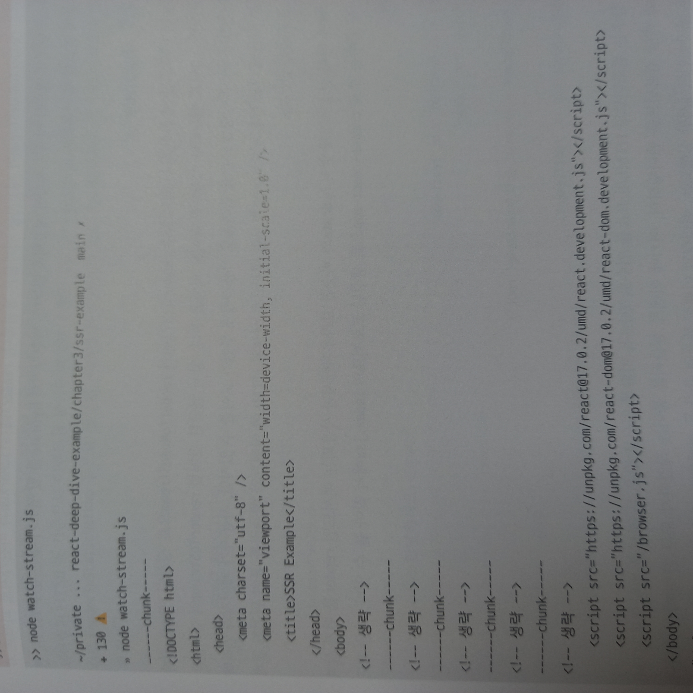
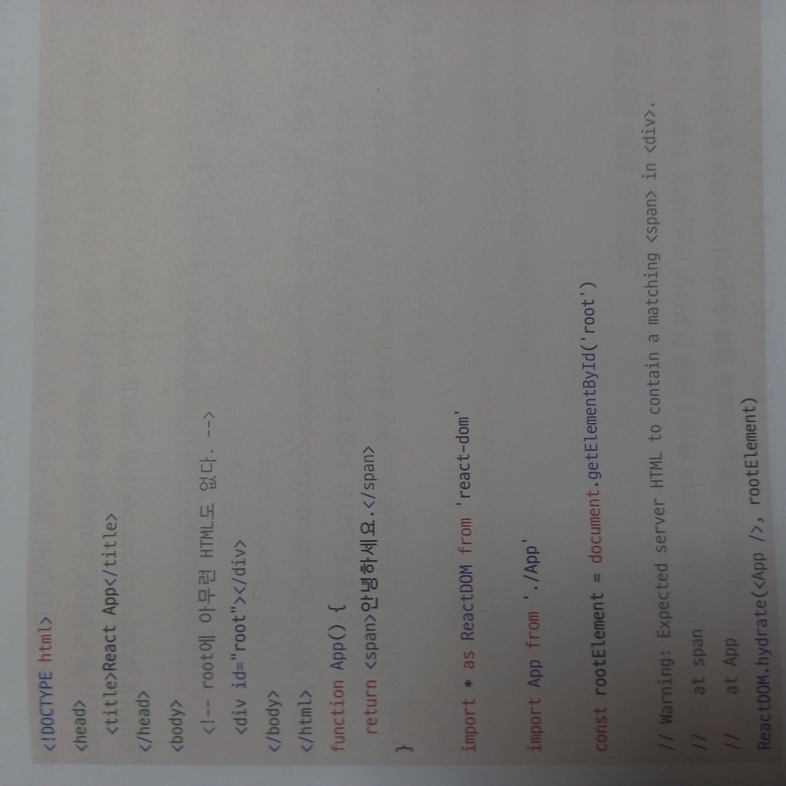

# SSR을 위한 리액트 API

## renderToString

서버에서 빠르게 리액트 코드를 읽은 후에 HTML 코드 (문자열)로 바꿔주는 함수

여기서 useEffect나 eventhandler는 포함되지 않는다. 빠르게 HTML 코드만 보여주는 용도이다.

인터랙션을 위해서는 이와 관련된 JS를 다운 파싱 실행 하는 과정이 더 필요하다.

추후 hydration을 위해서 data-reactroot 속성을 루트 엘리먼트에 삽입하며 메타데이터도 이 과정에서 HTML코드 안에 넣게 된다.

## renderToStaticMarkup

renderToString과 같은데 data-reactroot 같은 리액트 관련된 DOM 속성을 만들지 않는다.

이 함수로 렌더링을 수행하면 useEffect 같은 브라우저 관련 API를 사용할 수 없다.

이 함수의 결과물을 기반으로 JS 이벤트 리스너를 등록하는 hydrate 같은 것을 수행하면 서버와 클라이언트 내용이 맞지 않다는 에러를 발생시킨다.

## renderToNodeStream

`renderToString`과 결과물은 동일하게 보인다.

두 가지 차이점이 존재한다.
1. 브라우저에서 실행할 수 없다. (완전히 Node.js 환경에 의존하고 있다.)
2. 결과물의 타입이 Node.js의 ReadableStream이다. (utf-8로 인코딩된 바이트 스트림, 서버 환경에서만 사용할 수 있다.)

Stream : 큰 데이터를 다룰 때 데이터를 chunk(작은 단위)로 분할해 조금씩 가져오는 방식

```node.js
;(async ()=>{
	const response = await fetch('url');

	try{
		for await (const chunk of response.body){
			console.log('--chunk--');
			console.log(Buffer.from(chunk).toString());
		}
	}catch (err){
		console.error(err.stack);
	}
})()
```

이 Node.js 코드를 활용해서 렌더링하면 다음과 같다.



데이터를 분할해서 받는 걸 알 수 있다.

이는 서버의 부담을 줄여주고 HTML 파일이 완성될 때까지 기다리지 않아도 되게 해준다. 리액트 SSR Framework들은 renderToString 대신 renderToNodeStream을 사용한다.

## renderToStaticNodeStream

`renderToNodeStream`의 Static 버전이다. 리액트 속성이 제공되지 않아 hydrate 할 필요 없는 순수 HTML 결과물이 필요할 때 사용하는 메서드이다.

## render

`ReactDom.render(<App />,rootElement)`

클라이언트에서만 실행시킬 수 있으며 컴포넌트와 HTML을 바탕으로 HTML 요소를 컴포넌트에 렌더링하고 이벤트 핸들러를 붙인다.

rootElement는 빈 HTML이다.



## hydrate

`ReactDOM.hydrate(<App />, element`

`render`와의 차이점은 기본적으로 이미 렌더링된 HTML이 있다는 가정하에 작업이 수행된다.

`renderToString`과 `renderToNodeStream`으로 정적 생성된 HTML 콘텐츠에 JS 핸들러나 이벤트를 붙이는 역할을 한다.

`renderToStaticMarkup` 같은 JS없는 HTML을 반환하는 함수의 결과물을 두번째 인수에 넣고 리액트 컴포넌트랑 비교시키면

리액트 컴포넌트가 동적으로 만든 HTML와 두번째 인수의 HTML이 달라서 에러가 발생하게 된다.

그럼에도 정상적으로 페이지를 만들긴 하는데 이는 hydrate가 렌더링을 한번 더 수행하면서 그 기준으로 작업을 하기 때문이다.

에러가 뜬 상태라면 결국 두 번 렌더링 하게 되는 것이다.

 